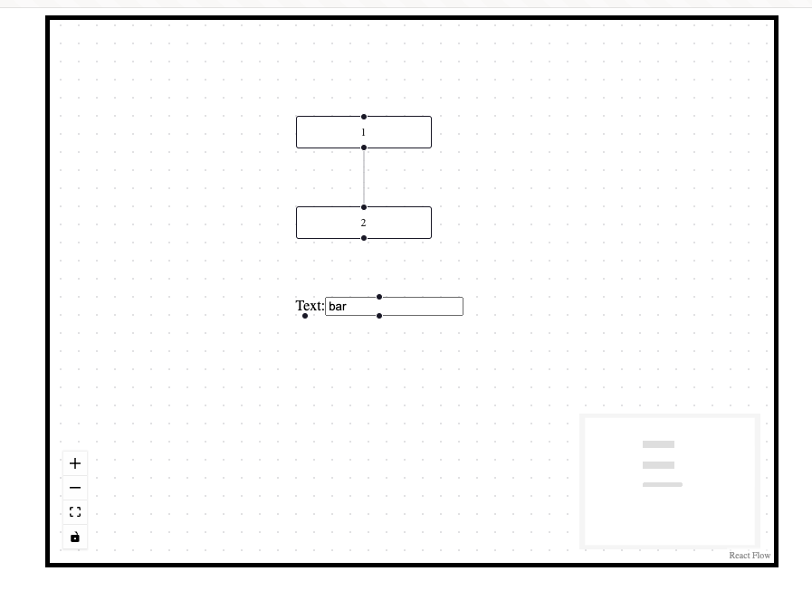

# Flowchart using "reactflow"
https://reactflow.dev/


## Setup
- You must have git installed on your machine
- You must have NodeJS 20+ installed on your machine
- Clone the repository: 
  - `git clone git@github.com:cfurrow/flowchart-spike.git`
  - or this: `git clone https://github.com/cfurrow/flowchart-spike.git`
- Change into the directory: `cd flowchart-spike`
- Make sure you're on the right branch: `git checkout react-flow`

Now you should be able to run the following, which will open a browser window with the app running:

```sh
npm install

npm run serve
```

You should see something like this:


